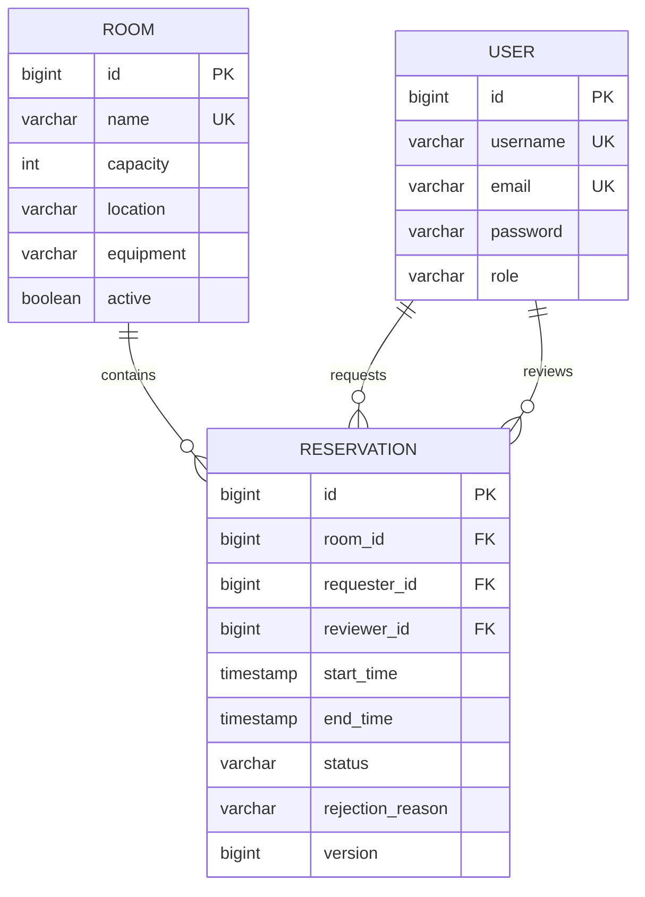

# Meeting Room Reservation API

Spring Boot + PostgreSQL 會議室預約後端，實作預約衝突防護、審核流程、Timeline/月報查詢、JWT、Flyway、OpenAPI 與 Testcontainers。

## 快速驗收

### 1. 啟動服務

需求：Docker Desktop 已啟動，並支援 Docker Compose v2。

在解壓後、包含 `compose.yaml` 的專案根目錄執行：

```powershell
docker compose up --build -d
docker compose ps
```

等待 `app` 與 `postgres` 都顯示 `healthy`，再檢查：

```powershell
Invoke-RestMethod http://localhost:8080/actuator/health
```

預期結果為 `status = UP`。

| 項目 | 網址 |
|---|---|
| Web Demo | http://localhost:8080/ |
| Swagger UI | http://localhost:8080/swagger-ui.html |
| OpenAPI JSON | http://localhost:8080/v3/api-docs |
| Health Check | http://localhost:8080/actuator/health |

### 2. Demo 帳號

| 帳號 | 密碼 | 角色 |
|---|---|---|
| `alice` | `password` | USER |
| `reviewer` | `password` | REVIEWER |
| `admin` | `password` | ADMIN |

### 3. 執行測試

Windows PowerShell：

```powershell
.\mvnw.cmd test
```

ZIP 交付時必須同時包含 `mvnw`、`mvnw.cmd` 與隱藏目錄 `.mvn/wrapper/`，否則 Maven Wrapper 無法啟動。

預期：

```text
Tests run: 14, Failures: 0, Errors: 0, Skipped: 0
BUILD SUCCESS
```

Docker Desktop 必須運作，Testcontainers 才能執行真實 PostgreSQL 併發測試。

## 主要功能與設計

| 項目 | 說明與檢查位置 |
|---|---|
| Docker / 專案執行 | `Dockerfile`、`compose.yaml`；App 與 PostgreSQL 皆有 health check，可用一個指令完成建置與啟動 |
| Entity / DB Schema | `domain/Room.java`、`User.java`、`Reservation.java`；包含 PK、FK、unique、check constraint、audit 欄位與 optimistic version |
| 預約核心邏輯 | `service/MeetingRoomService.java`；驗證時間、人數、容量、房間狀態、使用者身分與重疊時段 |
| 查詢與 Timeline API | `RoomController`、`ReservationController`；提供房間 ID/名稱 JOIN 查詢、每日 Timeline 與每月狀態統計 |
| 狀態與審核流程 | `PROCESSING -> APPROVED/REJECTED`；僅 REVIEWER/ADMIN 可審核；退回原因必填；禁止重複審核 |
| 錯誤處理與 Validation | DTO Bean Validation、`GlobalExceptionHandler`；統一處理 400、401、403、404、409、422 |
| 自動化測試 | Service/API integration tests 與 PostgreSQL Testcontainers test，共 14 項 |
| 程式碼結構 | 依 `api/domain/repository/service/security/config/exception` 分層；Controller 使用 DTO，不直接暴露 Entity |

### 進階技術

| 項目 | 說明與檢查位置 |
|---|---|
| 併發處理 | `PESSIMISTIC_WRITE` 序列化同房間請求；PostgreSQL GiST exclusion constraint 作為資料庫最終防線 |
| Flyway | `src/main/resources/db/migration/V1__create_schema.sql`、`V2__enforce_review_state_consistency.sql` |
| Swagger / OpenAPI | springdoc OpenAPI 3.1、Swagger UI、JWT Bearer schema；執行後由 `/v3/api-docs` 取得規格 |
| Spring Security / JWT | BCrypt 密碼、JWT filter、stateless session、角色授權與 401/403 JSON |
| Testcontainers | `MeetingRoomPostgresContainerTest.java` 使用 PostgreSQL 16，驗證 migration、constraint 與同步請求 |
| 系統設計 | 本 README 說明 ER 模型、狀態流程、併發策略、API Demo 與驗收方式 |

## Demo 流程

以下流程可直接用於 Swagger 驗收或 2-3 分鐘 Demo 錄影。

### 1. 一般使用者登入

執行 `POST /api/auth/login`：

```json
{
  "username": "alice",
  "password": "password"
}
```

複製回傳的 `token`，點 Swagger 右上角 **Authorize** 並貼上。

### 2. 建立預約

執行 `POST /api/reservations`：

```json
{
  "roomId": 1,
  "userId": 1,
  "title": "API Demo Meeting",
  "description": "Request-to-result demonstration",
  "attendeeCount": 4,
  "startTime": "2026-07-15T10:00:00",
  "endTime": "2026-07-15T11:00:00"
}
```

預期回傳 HTTP `201`，狀態為 `PROCESSING`。請記下預約 `id`。

實際測試時必須使用尚未過期、尚未被預約的未來日期。

### 3. 展示衝突處理

再次建立相同房間的重疊時段，例如 `10:30-11:30`。

預期回傳 HTTP `409 Conflict`。這同時展示預約核心邏輯、錯誤處理與併發一致性。

### 4. 審核者登入

重新執行 `POST /api/auth/login`：

```json
{
  "username": "reviewer",
  "password": "password"
}
```

將 Swagger Authorize 更新為 reviewer token。

### 5. 通過預約

執行 `PATCH /api/reservations/{id}/review`，`id` 使用步驟 2 的回傳值：

```json
{
  "reviewerId": 2,
  "status": "APPROVED",
  "reason": null
}
```

預期回傳 HTTP `200`，狀態為 `APPROVED`，並包含 reviewer 與 reviewed time。

退回時使用 `REJECTED`，且 `reason` 必填。

### 6. 查詢 API

```text
GET /api/reservations/timeline?date=2026-07-15
GET /api/reservations/monthly?month=2026-07&status=APPROVED
GET /api/rooms/1/reservations
GET /api/rooms/by-name/Taipei%20101/reservations
```

Timeline 只回傳 `APPROVED` 預約，依時間及會議室排序，並統計當日已使用的會議室數。

## 系統設計

### ER 模型



### 狀態流程

```text
PROCESSING -> APPROVED
PROCESSING -> REJECTED
```

- 新預約固定為 `PROCESSING`。
- 只有 REVIEWER/ADMIN 能審核。
- 已審核資料不能再次變更。
- `REJECTED` 必須提供原因，且退回後釋放時段。

### 併發策略

1. Service transaction 先對 Room 使用 `PESSIMISTIC_WRITE`。
2. 應用層檢查 `PROCESSING`/`APPROVED` 的重疊時段。
3. PostgreSQL `EXCLUDE USING gist` constraint 防止競態條件繞過應用層。
4. 時段採 `[start, end)`，因此 `10:00-11:00` 與 `11:00-12:00` 可以相鄰。

## 停止與重置

停止服務並保留資料：

```powershell
docker compose down
```

清除資料後重新驗收：

```powershell
docker compose down -v
docker compose up --build -d
```

## 常見啟動問題

- `docker` 找不到：安裝並啟動 Docker Desktop，再重開 PowerShell。
- 無法連接 Docker API：等待 Docker Engine 顯示 Running。
- `project name must not be empty`：切換到包含 `compose.yaml` 的專案目錄。
- `port is already allocated`：釋放 `8080` 或 `5432`。
- 容器未變成 healthy：執行 `docker compose logs app` 或 `docker compose logs postgres`。
